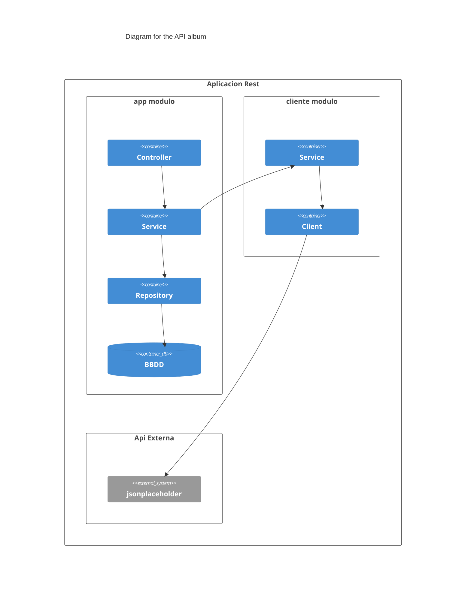

# Albums
API Rest expone  y enriquece unos datos de https://jsonplaceholder.typicode.com/


# Requisitos
- Docker
- JDK 17 
Podemos descargar el JDK17 en el script en el directorio raiz llamado download-JDK-17.bat
Para usar gradle 8.5 usamos el wrapper ```gradlew -v```


# Configuración inicial
[Configuración incial con las librerías](https://start.spring.io/#!type=gradle-project&language=java&platformVersion=3.2.1&packaging=war&jvmVersion=17&groupId=com.typicode&artifactId=jsonplaceholder&name=jsonplaceholder&description=Api%20Rest&packageName=com.typicode.jsonplaceholder&dependencies=data-jpa,h2,web,devtools,cloud-feign,lombok)


# Iniciar localmente
1. Compilar
```gradlew build```
2. Arrancar local
```gradlew bootRun```
3. Consultar documentacion SpringDoc
```start http://localhost:8080/swagger-ui/index.html```


# Desplegar en docker
1. Compilar imagen
```docker build -t api . ```
2. Ejecutar contenedor
```docker run -dp 8080:8080 api ```
3. Ver logs
```docker logs -f api ```

# Funcionalidad
Este aplicación Spring MVC que expone los siguientes endpoints:

| Verbo                  | endpoint              |descripcion            |
| :----------------------|:---------------------:| ---------------------:|
| GET                    | /albums/api           | Ver todos los albunes de la API enriquecidas con sus correspondientes photos.    |
| GET                    | /albums/api/{id}      | Ver un album                                                    |
| GET                    | /albums/db/{id}       | Ver el album de la bbdd.                                        |
| GET                    | /albums/db            | Ver todos los albunes de la bbdd.                               |
| PUT                    | /albums/db            | Guardar los albunes y photos de la API externa en la bbdd.      |


# Decisión de patrones de diseño
Usamos el patrón MCV para separar en capas las diferentes partes.
Según la regla de dependencia la capas superiores de la aplicación dependen de las inferiores. 
La capa *Controller* depende de la capa de *servicio* y esta a su vez del *repository*.

He divido la aplicación en dos módulos, el módulo *app* que se encarga de públicar los endpoints y la persistencia
y por el otro lado, módulo del *client* que se conecta a jsonplaceholder y se encarga de enriquecer los datos.

Además pensando en la optimización en las consultas de la api externa, he añadido el patrón proxy 
en `com.ruben.prueba.client.service.ProxyApiServiceImpl`, el cual guarda en cache el listado de albunes enriquecidos
y se actualiza cada cierto número de consultas. Otra solución podría ser abrir un thread para cargar la cache 
y no interferir en las consultas.

Para la persistencia usamos Spring Data Repositories que provee una implementación 
generica para hacer un CRUD evitando el boilerplate.


# Módulo app
**Controller** gestiona las peticiones de la API Rest
**Service** implementa la lógica del negocio (casos de uso)
**Repository** persistir los beans del modelo en BBDD.
**exceptions** configuracion general de la app
**models** la clases que modelan el negocio

# Módulo client
**consume** cliente API de REST de la API pública jsonplaceholder.
**models** la clases que modelan el negocio
**Service** implementa la lógica del negocio (casos de uso)


# Rendimiento del algoritmo 
La api externa devuelte 100 albunes con 50 fotos cada una.
Para enriquecen los albunes con sus correspondientes fotos. 
podríamos iterara sobre los albunes y luego sobre cada foto 
lo que es muy ineficiente con una complejidad cuadrática O(n²)	

Por lo que, primero agrupamos los fotos por el album al que corresponde.
y nos da los listados de fotos de cada album.
Luego iteramos sobre cada album para añadir los listados de fotos
de esta manera la complejidad sería de O(n)	

El algoritmo esta en la funcion `albumsWithPhotos()` del paquete
`com.ruben.prueba.client.service.ApiServiceImpl`



# BBDD
Aceder a la consola de h2 -> http://localhost:8080/h2-ui/

Algunas queries para hacer pruebas
```
SELECT * FROM PHOTO;
SELECT * FROM Album;
INSERT INTO ALBUM VALUES(1, 'title',10);
INSERT INTO PHOTO VALUES(1, 1, 'THUMBNAIL_URL','TITLE','URL');
INSERT INTO PHOTO VALUES(2, 1, 'THUMBNAIL_URL','TITLE','URL');
INSERT INTO PHOTO VALUES(3, 1, 'THUMBNAIL_URL','TITLE','URL');
INSERT INTO ALBUM VALUES(2, 'title',10);
INSERT INTO PHOTO VALUES(4, 2, 'THUMBNAIL_URL','TITLE','URL');
INSERT INTO PHOTO VALUES(5, 2, 'THUMBNAIL_URL','TITLE','URL');
INSERT INTO PHOTO VALUES(6, 2, 'THUMBNAIL_URL','TITLE','URL');
```

# Test de integración
1. Ejecutar todos los tests
```gradlew test``` 
Se genera reporte en:
```start app/build/reports/tests/test/index.html``` 
```start client/build/reports/tests/test/index.html``` 

2. Ejecutar los test de integracion
(Invoca la Api por lo que testear todas las capas de la aplicacion)
```gradlew test --tests com.ruben.prueba.app.IntegrationTests```

3. Ejecutar los test unitarios
(Testeamos la lógica del negocio, en al capa servicio)
```gradlew app:test --tests com.ruben.prueba.app.UnitTests```
```gradlew client:test --tests com.ruben.prueba.client.UnitTests ```

4. Ver cobertura
```gradlew jacocoTestReport```
```start app/build/reports/jacoco/test/html/com.ruben.prueba.app.services/index.html```
```start client/build/reports/jacoco/test/html/index.html```

5. Fichero postman
En el directorio raiz esta el fichero albums.postman.json
que podemos inportar en Postman v2.1


# Cobertura de los test
En un proyecto real una cobertura de los tests óptima estaría cercana al 80%.
En los test unitarios del modulo **client** la cobertura sobre la capa de servicio es
```com.ruben.prueba.client.service  100 %```
en el modulo **app** la cobertura es de
```com.ruben.prueba.app.services  97 %```


