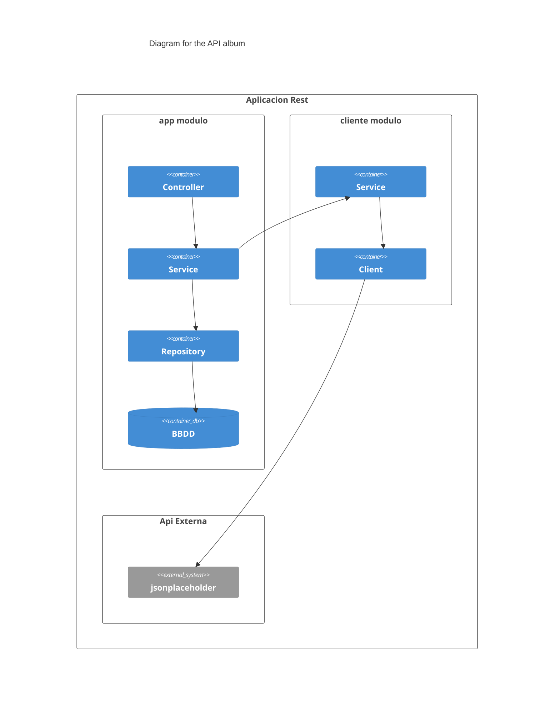

# Albums
API Rest expone unos albums y photos de https://jsonplaceholder.typicode.com/

# Requisitos
- Docker
- JDK 17 

Podemos descargar el JDK17 en el script en el directorio raiz llamado download-JDK-17.bat
Para usar gradle 8.5 usamos el wrapper ```gradlew -v```

# Configuracion inicial
https://start.spring.io/#!type=gradle-project&language=java&platformVersion=3.2.1&packaging=war&jvmVersion=17&groupId=com.typicode&artifactId=jsonplaceholder&name=jsonplaceholder&description=Api%20Rest&packageName=com.typicode.jsonplaceholder&dependencies=data-jpa,h2,web,devtools,cloud-feign,lombok

# Iniciar localmente
1. Compilar
```gradlew build```
2. Arrancar local
```gradlew bootRun```
3. Consultar documentacion SpringDoc
http://localhost:8080/swagger-ui/index.html

# Desplegar en docker
1. Compilar imagen
```docker build -t api . ```
2. Ejecutar contenedor
```docker run -dp 8080:8080 api ```
3. Ver logs
```docker logs -f api ```

# Funcionalidad
Aplicacion Spring MVC que expone los siguientes endpoints:

| Verbo                  | endpoint              |descripcion            |
| :----------------------|:---------------------:| ---------------------:|
| GET                    | /api/albums           | Ver todos los albunes de la API enriquecidas con sus correspondientes photos.    |
| GET                    | /api/albums/{id}      | Ver un album                                                    |
| GET                    | /db/albums/{id}       | Ver el album de la bbdd.                                        |
| GET                    | /db/albums            | Ver todos los albunes de la bbdd.                               |
| PUT                    | /db/albums            | Guardar los albunes y photos de la API externa en la bbdd.      |

** /api/albums** ver todos los albunes de la API enriquecidas con sus correspondientes photos.
**GET ** ver el album de
**GET ** ver el album de la bbdd.
**GET /db/albums** 
**PUT /db/albums** guardar los albunes y photos de la API externa en la bbdd.

# Pattern 
Usamos el patrón mcv para separar en capas las diferentes partes.
Según la regla de dependencia la capas superiores de la aplicación dependen de las inferiores. (y no al revés)
La capa *Controller* depende de la capa de *servicio*. Y esta a su vez del *repository* y el *client*.
Por otro lado las excepciones y el modelo son transversales del modelo MVC.
Debido a que el modelo (las clases album y photo) esta compartido tanto para una API externa como para la estructura de la bbdd
esta tiene dos motivos para ser modificado. Por tanto no cumple con el principio de responsabilidad única de SOLID. 

Esto podría solucionar usando empleando la arquitectura hexagonal, en la cual la llamada al servicio exterior estaría en 
un adaptador y la comunicación con la bbdd estaría en otro adaptador en la capa de infraestructura,
la cual se comunica a la capa de aplicación a través de los puertos. 
Manteniendo el modelo interno, esquema de BBDD, y la estrucutra del JSON de la API externa por separado.
sin embargo añadira una complejidad que fácilmente lleva a la sobreingenieria para un microservicio sencillo,
y romperia el príncipio KISS. 
Además el único objeto de la bbdd es persister los datos de la api externa, por lo que en la práctica 
si la api externa cambiara también deberiamos la estructura de la bbdd. 

Para la persistencia usamos Spring Data Repositories que provee una implementación 
generica para hacer un CRUD evitando el boilerplate.

**Controler** gestiona las peticiones de la API Rest
**Service** implementa la lógica del negocio (caso de usos)
**Repository** persistir los beans del modelo en BBDD.
**client** cliente API de REST de la API pública jsonplaceholder.
**exceptions** configuracion general de la app
**models** 



# BBDD
Aceder a la consola de h2 -> http://localhost:8080/h2-ui/

Algunas queries para hacer pruebas
```
SELECT * FROM PHOTO;
SELECT * FROM Album;
INSERT INTO ALBUM VALUES(1, 'title',10);
INSERT INTO PHOTO VALUES(1, 1, 'THUMBNAIL_URL','TITLE','URL');
INSERT INTO PHOTO VALUES(2, 1, 'THUMBNAIL_URL','TITLE','URL');
INSERT INTO PHOTO VALUES(3, 1, 'THUMBNAIL_URL','TITLE','URL');
INSERT INTO ALBUM VALUES(2, 'title',10);
INSERT INTO PHOTO VALUES(4, 2, 'THUMBNAIL_URL','TITLE','URL');
INSERT INTO PHOTO VALUES(5, 2, 'THUMBNAIL_URL','TITLE','URL');
INSERT INTO PHOTO VALUES(6, 2, 'THUMBNAIL_URL','TITLE','URL');
```

# Test de integracion
1. ejecutar todos los tests
```gradlew test ``` 
Se genera reporte en build/reports/tests/test/index.html

2. ejecutar los test de integracion
(Invoca la Api por lo que testear todas las capas de la aplicacion)
```gradlew test --tests com.prueba.api.IntegrationTests```

3. ejecutar los test unitarios
(Testeamos la lógica del negocio, en al capa servicio)
```gradlew test --tests com.prueba.api.UnitTests```

4. Ver cobertura
```gradlew jacocoTestReport```
Se genera reporte en build/reports/jacoco/test/html/index.html

5. Fichero postman
En el directorio raiz esta el fichero albums.postman.json
que podemos inportar en Postman v2.1


cobertura 
tura cercana al 80%), 